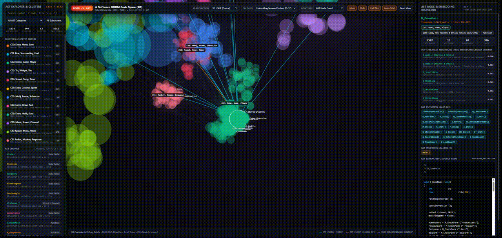

# DOOM (1993) 3D AST Code Space Explorer

An interactive 3D visualization and semantic code explorer for the official [id Software DOOM](https://github.com/id-Software/DOOM) C source code, built with **Tree-sitter C AST chunking**, **EmbeddingGemma 2** 768D vector embeddings, **3D manifold projections (UMAP, t-SNE, PCA)**, and **unsupervised clustering**.



## Overview

This project parses the original 1993–1997 DOOM source release (`linuxdoom-1.10`, `sndserv`, `ipx`, and `sersrc`) into structural Abstract Syntax Tree (AST) chunks, embeds each chunk into a 768-dimensional semantic vector space using **EmbeddingGemma 2**, clusters the resulting representations, and generates a zero-dependency interactive 3D HTML explorer (`index.html`).

### Key Capabilities

1. **Syntax-Aware C AST Chunking (`tree-sitter-c`)**
   - Unwraps `#ifndef` / `#ifdef` preprocessor header guards and extracts **1,132 structural AST chunks** across **144 `.c`/`.h` files**:
     - `function_definition` (**785** functions)
     - `type_definition` / `struct_specifier` (**173** structs, unions, and typedefs)
     - `preproc_def / declaration` (**91** module/header macro and interface bundles)
     - `declaration (data_table)` (**65** multi-line initialized tables such as `mobjinfo`, `states`, `weaponinfo`)
     - `enum_specifier` (**18** enums)
   - Computes AST structural metrics per chunk: **AST node count**, **AST subtree depth**, **cyclomatic complexity**, preceding doc comments, and **1,613 directed AST call-graph edges** (`call_expression` callers & callees).

2. **EmbeddingGemma Semantic Vectorization**
   - Formats each AST chunk with its subsystem, file context, AST node type, symbol signature, outgoing calls, doc comments, and C source code using the `task: clustering | query:` prompt.
   - Encodes chunks into L2-normalized **768D embeddings** using `SentenceTransformer` (`google/embeddinggemma-2`).
   - Precomputes exact **Top-6 Cosine Nearest Neighbors** in full 768D embedding space for every AST node.

3. **3D Dimensionality Reduction & Clustering**
   - Projects 768D embeddings into three switchable 3D coordinate spaces:
     - **3D UMAP** (cosine distance manifold)
     - **3D t-SNE** (cosine perplexity manifold)
     - **3D PCA** (top 3 principal components)
   - Groups AST chunks via **K-Means ($K=12$)** with automatic **TF-IDF cluster topic naming** and exemplar extraction, alongside **HDBSCAN** density clustering.

4. **Self-Contained 3D HTML Explorer (`index.html`)**
   - Interactive 3D perspective canvas with **Orbit, Pan, Zoom, Auto-Orbit**, and smooth camera fly-to animations.
   - Switch dynamically between **3D UMAP**, **3D t-SNE**, and **3D PCA** projections.
   - Color nodes by **EmbeddingGemma Clusters ($K=12$)**, **DOOM Engine Subsystem**, **AST Node Category**, **HDBSCAN Density Clusters**, or **Cyclomatic Complexity Heatmap**.
   - **3D Synaptic Arcs**: Hovering or clicking a node renders 3D curves to its **AST Callees** (cyan), **AST Callers** (amber), and **Top-6 768D EmbeddingGemma Nearest Neighbors** (purple).
   - Full-text & symbol search, cluster/subsystem filters, and a syntax-highlighted C source inspector panel.

## Project Structure

```text
/
├── process_doom_ast.py         # Step 1-3: Tree-sitter AST chunking, EmbeddingGemma encoding & 3D clustering
├── generate_html_explorer.py   # Step 4: Compiles doom_code_space.json into interactive 3D HTML
├── doom_code_space.json        # Extracted AST chunks, 3D coordinates, clusters, call graph & neighbors
├── doom_embeddings.npz         # Compressed NumPy archive of raw 768D embeddings & 3D coordinate matrices
├── index.html                  # Self-contained interactive 3D DOOM Code Space Explorer
├── doom_code_explorer.html     # Alias copy of index.html
└── requirements.txt            # Python dependencies
```

## Quick Start

### 1. Install Dependencies

```bash
pip install -r requirements.txt
```

### 2. Clone the DOOM Repository (if not already present)

```bash
git clone https://github.com/id-Software/DOOM.git
```

### 3. Run AST Chunking, EmbeddingGemma Encoding & 3D Clustering

```bash
python3 process_doom_ast.py
```

This script parses all C/H files in `DOOM/`, encodes the AST chunks with EmbeddingGemma, computes 3D UMAP/t-SNE/PCA projections and clusters, and writes `doom_code_space.json` and `doom_embeddings.npz`.

### 4. Generate the Interactive 3D HTML Explorer

```bash
python3 generate_html_explorer.py
```

### 5. Explore in Browser

Open `index.html` directly in any modern browser, or serve it locally:

```bash
python3 -m http.server 8000
# Open http://localhost:8000
```

## Discovered Semantic Clusters

| Cluster | Auto-Generated Topic Label | Dominant Subsystem | Chunks | Representative AST Symbols |
| :--- | :--- | :--- | ---: | :--- |
| **C00** | Packet, Modem, Response | DOS Network & Serial (`ipx`/`sersrc`) | 68 | `SERSETUP.C`, `I_Error`, `IPXNET.C` |
| **C01** | Draw, Rect, Get | OS, X11 Video & Hardware Interface (`I_*`) | 50 | `I_StartFrame`, `I_ReadScreen`, `i_video.h` |
| **C02** | Line, Spawn, Move | Playsim, AI & World Specials (`P_*`) | 150 | `P_FindLowestFloorSurrounding`, `P_XYMovement`, `P_LineOpening` |
| **C03** | Texture, Patches, Line | 3D BSP Software Renderer (`R_*`) | 46 | `maplinedef_t`, `maskdraw_t`, `mapseg_t` |
| **C04** | Draw, Hulib, Init | HUD, Automap, Status Bar & Finale (`AM`/`HU`/`ST`/`WI`/`F`) | 208 | `ST_loadData`, `ST_unloadData`, `HUlib_addLineToSText` |
| **C05** | Draw, Sprite, Init | 3D BSP Software Renderer (`R_*`) | 100 | `r_data.c`, `r_draw.h`, `R_RenderBSPNode` |
| **C06** | Demo, Game, Net | Game Loop, Net Ticcmds & Entity Tables (`D`/`G`/`info`) | 81 | `G_DoNewGame`, `G_BeginRecording`, `D_DoomMain` |
| **C07** | Mobj, Sig, Linked | Playsim, AI & World Specials (`P_*`) | 71 | `result_e`, `sdt_e`, `actionf_p1` |
| **C08** | Menu, Draw, Save | Menus, Fixed-Point Math & Utils (`M_*`) | 109 | `M_ReadThis2`, `M_Options`, `M_ReadThis` |
| **C09** | Lump, Heap, Name | Engine Core: WAD, Zone Memory & Video (`W`/`Z`/`V`) | 34 | `W_NumLumps`, `W_GetNumForName`, `Z_Malloc` |
| **C10** | Attack, Spawn, Fire | Playsim, AI & World Specials (`P_*`) | 116 | `A_StartFire`, `A_PainAttack`, `A_CPosAttack` |
| **C11** | Sound, Music, Song | Sound & Audio Server (`S_*`/`sndserv`) | 99 | `S_StartMusic`, `s_sound.h`, `i_sound.h` |

## Controls in the 3D Explorer

- **Left-Click + Drag**: Orbit 360° around the 3D embedding space
- **Right-Click / Shift + Drag**: Pan camera target
- **Mouse Wheel**: Zoom in / out
- **Click Node**: Inspect AST metrics, C source code, 768D EmbeddingGemma nearest neighbors, and caller/callee functions
- **Click Cluster in Left Sidebar**: Isolate cluster and smoothly fly the 3D camera to its centroid
